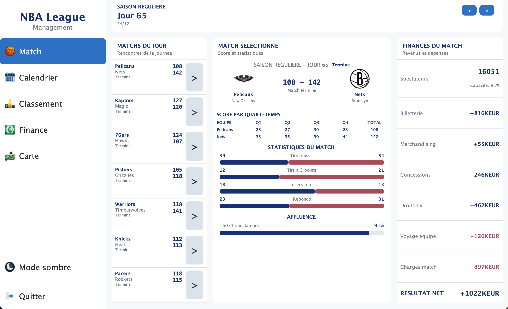
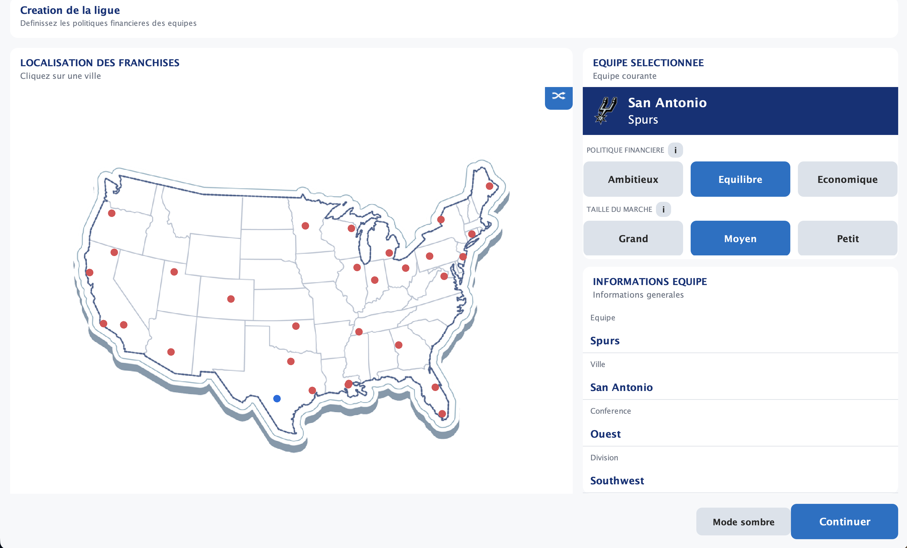
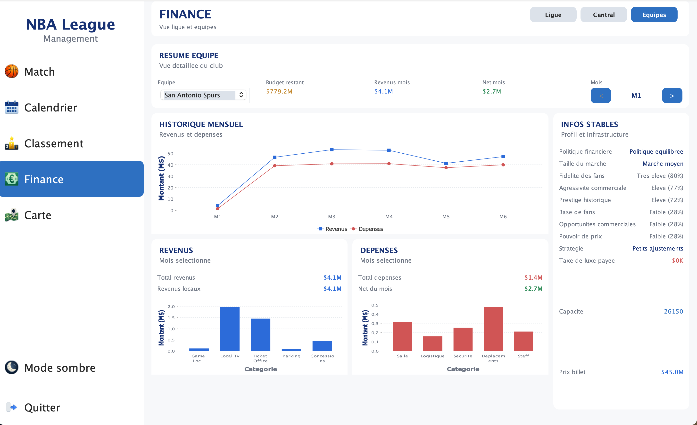
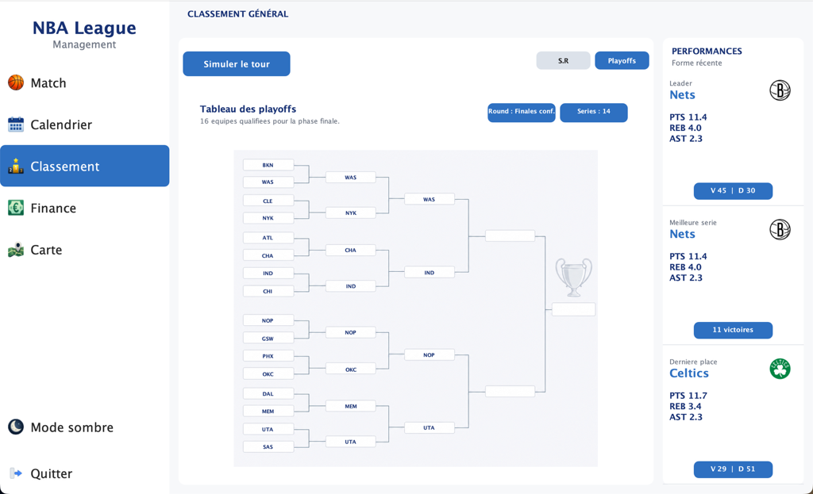
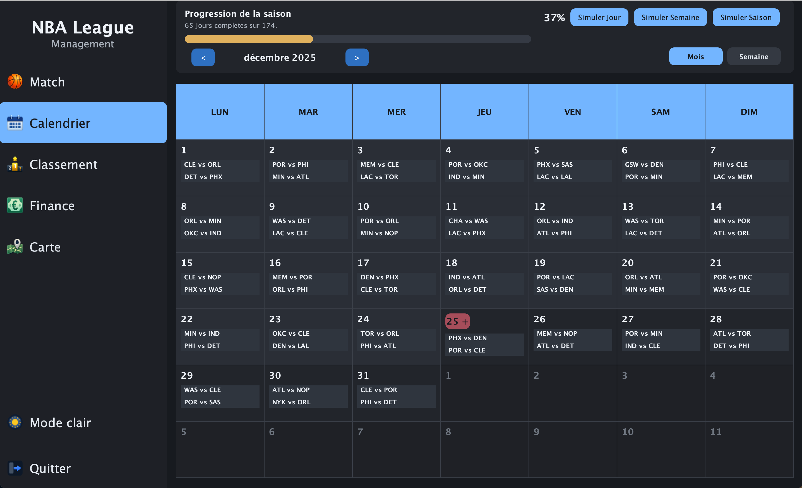

# Simulateur de ligue NBA

[English](README.md) | [Français](README.fr.md)

Application de bureau permettant de simuler une saison NBA au moyen d'une interface Java Swing.

> Cette application a été développée comme **projet universitaire collectif** pendant la deuxième année de licence informatique. Ce dépôt préserve l'origine collective du projet et son historique Git.



## Fonctionnalités

- Sélectionner et gérer une équipe NBA
- Configurer les paramètres financiers initiaux de l'équipe
- Simuler la saison régulière et les playoffs
- Consulter le calendrier, les résultats et le classement de la ligue
- Suivre les actions et les statistiques d'un match
- Examiner les finances de l'équipe, de la ligue et des matchs
- Visualiser les données financières avec des graphiques
- Consulter les effectifs et réaliser des échanges de joueurs
- Passer à un thème sombre pour améliorer le confort visuel et répondre à différentes préférences d'affichage

## Captures d'écran

| Configuration de la ligue et politiques financières | Analyse financière |
| --- | --- |
|  |  |

| Tableau des playoffs | Thème sombre |
| --- | --- |
|  |  |

Le thème sombre fournit un affichage alternatif destiné à améliorer le confort visuel. Il s'agit d'une option d'interface et non de l'affirmation que l'application a fait l'objet d'un audit complet d'accessibilité.

## Technologies

- Java et Swing
- JFreeChart / JCommon pour la visualisation de données
- Log4j 1.2 pour la journalisation de l'application
- JUnit 4 pour les tests automatisés
- Ressources CSV contenant les données de la ligue

Les dépendances sont incluses dans [`lib/`](lib/) : aucun gestionnaire de paquets n'est nécessaire.

## Exécuter le projet localement

### Prérequis

- JDK 8 ou version ultérieure
- Un terminal : shell macOS/Linux ou Windows PowerShell

### macOS / Linux

Depuis la racine du dépôt, compiler l'application :

```bash
mkdir -p out
find src -name '*.java' -print0 \
  | xargs -0 javac -encoding UTF-8 -cp 'lib/*' -d out
```

La lancer avec :

```bash
java -cp 'out:src:lib/*' gui.app.App
```

### Windows PowerShell

Depuis la racine du dépôt, créer le dossier de sortie et compiler tous les fichiers sources Java :

```powershell
New-Item -ItemType Directory -Force out | Out-Null
$Sources = Get-ChildItem -Path src -Recurse -Filter *.java |
  ForEach-Object { $_.FullName }
javac -encoding UTF-8 -cp "lib/*" -d out $Sources
```

Lancer l'application avec :

```powershell
java -cp "out;src;lib/*" gui.app.App
```

> Ces commandes respectent la syntaxe du classpath Windows (`;`), mais elles n'ont pas été exécutées sur une machine Windows pendant la vérification de ce dépôt.

Le point d'entrée de l'application est [`src/gui/app/App.java`](src/gui/app/App.java).

## Tests

Le projet contient des tests unitaires, d'usage, de robustesse et de performance dans [`src/test/`](src/test/). Le dossier des tests unitaires contient actuellement 24 classes de test JUnit et 124 méthodes annotées avec `@Test`.

Après la compilation, une classe de test peut être exécutée sur macOS/Linux avec :

```bash
java -cp 'out:src:lib/*' \
  org.junit.runner.JUnitCore test.unit.TestFinanceTypeResolver
```

Ou sur Windows PowerShell avec :

```powershell
java -cp "out;src;lib/*" org.junit.runner.JUnitCore test.unit.TestFinanceTypeResolver
```

Pour exécuter toutes les classes de tests unitaires depuis un shell macOS/Linux :

```bash
TEST_CLASSES=$(find src/test/unit -name 'Test*.java' \
  | sed 's#src/##; s#/#.#g; s#\.java$##' \
  | tr '\n' ' ')

java -cp 'out:src:lib/*' org.junit.runner.JUnitCore $TEST_CLASSES
```

Pour exécuter toutes les classes de tests unitaires depuis Windows PowerShell :

```powershell
$TestClasses = Get-ChildItem -Path src/test/unit -Recurse -Filter 'Test*.java' |
  ForEach-Object {
    $_.FullName.Substring((Resolve-Path src).Path.Length + 1) `
      -replace '\\', '.' -replace '\.java$', ''
  }

java -cp "out;src;lib/*" org.junit.runner.JUnitCore $TestClasses
```

## Structure du projet

```text
src/
├── config/       # Configuration de la simulation et des finances
├── data/         # Modèles de la ligue, des équipes, joueurs, matchs et finances
├── gui/          # Fenêtres, tableaux de bord, panneaux et composants Swing
├── log/          # Configuration de Log4j
├── process/      # Construction, services, simulation et orchestration
├── resources/    # Données CSV de la ligue et ressources graphiques
└── test/         # Tests automatisés
```

## Ma contribution

Ma contribution à ce projet collectif s'est concentrée sur :

- le développement de certaines parties de l'interface graphique avec Java Swing ;
- la participation aux discussions de conception fonctionnelle ;
- l'aide à la planification et à la priorisation du travail nécessaire pour respecter les attentes du devoir et sa date limite.

Le projet n'a pas été développé individuellement. La relation de fork et l'historique Git sont volontairement conservés afin de créditer l'ensemble de l'équipe.

## Contexte universitaire

Projet de génie logiciel développé en deuxième année de licence informatique.
