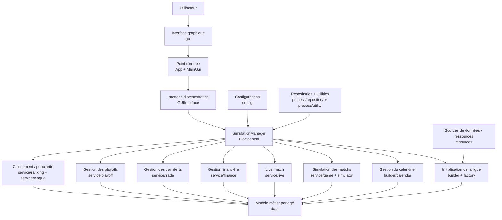

# Architecture

## Vue d’ensemble

- `config` → constantes globales de simulation et de finance.
- `data` → modèle métier de la ligue, des équipes, des joueurs et des matchs.
- `process` → chargement des données, orchestration, génération du calendrier et simulation.
- `gui` → interface Swing, navigation et dashboards.

Le projet suit une séparation simple :

- les objets de `data` stockent surtout l’état ;
- les classes de `process` construisent et font évoluer cet état ;
- les classes de `gui` affichent une maquette d’application autour de ces données.

## Diagramme en blocs fonctionnel

## Lecture du schéma

- L’utilisateur interagit avec l’application via l’IHM Swing.
- `App` et `MainGui` mettent en place l’interface puis délèguent toutes les actions métier à `GUIInterface`.
- `SimulationManager` est le centre fonctionnel du logiciel : il coordonne toute la logique applicative.
- Autour de ce bloc central, on trouve les grands sous-systèmes métier : initialisation, calendrier, simulation, live, finance, transferts, playoffs et classement.
- Tous ces blocs manipulent le même noyau métier dans `src/data`.
- Les `config`, `resources`, `repository` et `utility` soutiennent le fonctionnement global sans porter l’interface.

## Vue simple des dossiers

- `src/config`
  - `CalendarConfiguration`
  - `FinanceConfiguration`
  - `GameConfiguration`
  - `HealthConfiguration`
  - `TeamConfiguration`

- `src/data`
  - `league`, `team`, `player` : noyau métier
  - `calendar` : jours de match et événements spéciaux
  - `sport` : contexte, résultat et actions de jeu
  - `finance` : budgets, revenus, dépenses, transferts

- `src/process`
  - `orchestrator/manager/SimulationManager` : chef d’orchestre de l’application
  - `builder/*` : construit ligue, calendrier et finance
  - `service/*` : gère matchs, finance, playoffs, live, classement et trades
  - `simulator/*` : simulation détaillée de match et de transferts
  - `repository/*` : registres partagés
  - `visitor/*` : stratégies et traitements spécialisés

- `src/gui`
  - `frame` : fenêtre principale
  - `layout` : barre latérale
  - `dashboard` : vues principales
  - `panel` : briques graphiques réutilisables

## Rôle des grands blocs

### CONFIG

- Fournit les constantes utilisées partout dans le projet.
- Évite de dupliquer les valeurs de dates, de quotas, de probabilités et de seuils financiers.

### DATA

- Contient les entités du domaine.
- `League` relie conférences, divisions, saisons et finance globale.
- `Team` et `Player` portent l’essentiel des données manipulées par la simulation.

### PROCESS

- Porte la logique métier réelle.
- Lit le fichier CSV, instancie les objets, génère les rencontres puis simule les journées.
- Utilise des registres (`PlayerRepository`, `TeamRepository`, etc.) pour retrouver rapidement les objets déjà créés.

### GUI

- Assemble une interface Swing à base de `JFrame`, `JPanel` et `CardLayout`.
- La GUI reste surtout une couche de présentation.
- Elle ne contient pas le cœur de la simulation sportive.

## Classes centrales du système

- `SimulationManager`
  - Orchestrateur principal.
  - Lance la construction de la ligue, le démarrage de la saison puis la simulation des jours, semaines et phases de playoffs.

- `LeagueBuilder`
  - Lit les données NBA depuis `src/resources/*.csv`.
  - Construit `League`, `Team`, `Player` et initialise les registres.

- `League`
  - Objet racine du domaine.
  - Donne accès aux conférences, à la saison régulière, aux playoffs et à la finance de ligue.

- `RegularSeasonCalendarBuilder`
  - Prépare la saison régulière.
  - Génère les affiches et répartit les matchs par date.

- `GameManager`
  - Coordonne la simulation des journées de saison régulière et de playoffs.

- `LiveMatchService`
  - Expose le suivi détaillé d’un match simulé.

- `MainGui`
  - Fenêtre principale de l’interface.
  - Passe de l’écran d’ouverture aux dashboards via `CardLayout`.

## Dépendances principales

- `process` dépend fortement de `data` et de `config`.

- `SimulationManager` dépend notamment de :
  - `LeagueBuilder`
  - `RegularSeasonCalendarBuilder`
  - `FirstRoundCalendarBuilder`
  - `GameManager`
  - `FinanceManager`
  - `PreSeasonTradeService`
  - `RegularSeasonTradeService`
  - `LiveMatchService`
  - `TeamPopularityUpdater`

- `LeagueBuilder` dépend de :
  - `PlayerFactory`
  - `TeamFactory`
  - `DivisionRepository`
  - `PlayerRepository`
  - `TeamRepository`
  - `PreSeasonAssetRepository`
  - `CurrentSeasonAssetRepository`

- `RegularSeasonCalendarBuilder` dépend de :
  - `League`
  - `GameGenerator`
  - `SpecialEventPlanner`
  - `ScheduleNotifier`

- `GameManager` et les simulateurs dépendent de :
  - `Player`, `Team`, `Game`, `GameResult`
  - les actions de `data/sport/play`
  - les statistiques de `Asset`
  - `FinanceManager` pour les effets financiers liés aux rencontres

- `gui` dépend surtout de :
  - `gui/dashboard`
  - `gui/layout`
  - `gui/panel`
  - `process/orchestrator/interf/GUIInterface`

## Points structurants à retenir

- Le modèle métier est assez riche, mais beaucoup de classes `data` sont surtout des conteneurs.

- La logique métier est concentrée dans peu de classes :
  - `SimulationManager`
  - `LeagueBuilder`
  - `GameManager`
  - `RegularSeasonCalendarBuilder`
  - `FinanceManager`
  - `LiveMatchService`

- L’entrée exécutable actuelle est `src/gui/app/App.java`.
- Le point de couplage principal entre l’IHM et le métier est `GUIInterface`, implémentée par `SimulationManager`.
